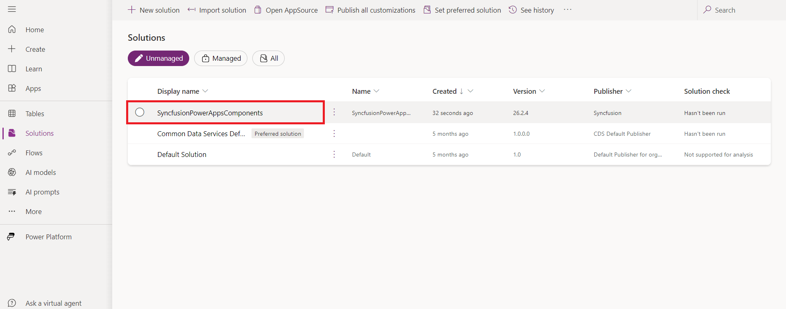

# Syncfusion PowerApps Code Components

The **Syncfusion PowerApps Code Components** library provides a modern, efficient, and user-friendly suite of components tailored for PowerApps. Built on the [PowerApps Component Framework (PCF)](https://learn.microsoft.com/en-us/power-apps/developer/component-framework/overview), these components seamlessly integrate with Canvas apps, Model-driven apps, and Power Pages (Portals). It offers a rich set of features and functionalities that are essential for any business application, ensuring a streamlined development experience.

## Repository structure

The repository is organized into the following folders:

| Folders | Description |
| -------------------------- | ------------------------------------------------ |
| [`components`](components) | Contains the Syncfusion code components. |
| [`docs`](docs)             | Contains the documentation for Syncfusion code components. |
| [`SyncfusionPowerAppsComponents`](SyncfusionPowerAppsComponents) | Contains the generated solution project and solution file with all Syncfusion code components in the **components** folder (Available after running the `npm run pack` command). |

## Components list

The Syncfusion PowerApps Code components library includes the following components, which can be used in supported PowerApps applications:

| Code component | Supported Apps |
| ------------------------ | ----------------------------------------------------------- |
| [Grid](components/grids) `Preview` | ✅ [Local (TestHarness)](docs/grids/getting-started-with-code-component.md) <br/> ✅ [Canvas](docs/grids/getting-started-with-canvas.md) <br/> ✅ [Model-Driven (Form)](docs/grids/getting-started-with-model-driven-form.md) <br/> ✅ [Model-Driven (Custom Pages)](docs/grids/getting-started-with-model-driven-custom-pages.md) <br/> ⬜ PowerPages (Portals) |
| [Chart](components/charts) `Preview` | ✅ [Local (TestHarness)](docs/charts/getting-started-with-code-component.md) <br/> ✅ [Canvas](docs/charts/getting-started-with-canvas.md) <br/> ✅ [Model-Driven (Form)](docs/charts/getting-started-with-model-driven-form.md) <br/> ✅ [Model-Driven (Custom Pages)](docs/charts/getting-started-with-model-driven-custom-pages.md) <br/> ✅ [PowerPages (Portals)](./docs/charts/getting-started-with-power-pages.md) |
| [Schedule](components/schedule) `Preview` | ✅ [Local (TestHarness)](docs/schedule/getting-started-with-code-component.md) <br/> ✅ [Canvas](docs/schedule/getting-started-with-canvas.md) <br/> ✅ [Model-Driven (Form)](docs/schedule/getting-started-with-model-driven-form.md) <br/> ✅ [Model-Driven (Custom Pages)](docs/schedule/getting-started-with-model-driven-custom-pages.md) <br/> ✅ [PowerPages (Portals)](./docs/schedule/getting-started-with-power-pages.md) |
| [PdfViewer](components/pdfviewer) `Preview` | ✅ [Local (TestHarness)](docs/pdfviewer/getting-started-with-code-component.md) <br/> ✅ [Canvas](docs/pdfviewer/getting-started-with-canvas.md) <br/> ✅ [Model-Driven (Form)](docs/pdfviewer/getting-started-with-model-driven-form.md) <br/> ✅ [Model-Driven (Custom Pages)](docs/pdfviewer/getting-started-with-model-driven-custom-pages.md) <br/> ⬜ PowerPages (Portals) |
| [PivotView](components/pivotview) `Preview` | ✅ [Local (TestHarness)](docs/pivotview/getting-started-with-code-component.md) <br/> ✅ [Canvas](docs/pivotview/getting-started-with-canvas.md) <br/> ✅ [Model-Driven (Form)](docs/pivotview/getting-started-with-model-driven-form.md) <br/> ✅ [Model-Driven (Custom Pages)](docs/pivotview/getting-started-with-model-driven-custom-pages.md) <br/> ✅ [PowerPages (Portals)](docs/pivotview/getting-started-with-model-driven-custom-pages.md) <br/>

<em>Anticipate future updates to the component list. \*</em>

## Install the prerequisites

Before starting with the Syncfusion PowerApps Code Components library, ensure the following prerequisites are installed:

- [node.js  (>= v18.20.4)](https://nodejs.org/en/download/) (LTS version is recommended)
- [.NET 6.x SDK](https://dotnet.microsoft.com/en-us/download/dotnet/6.0)
- [Microsoft Power Platform CLI](https://learn.microsoft.com/en-us/power-platform/developer/cli/introduction#install-microsoft-power-platform-cli)
- [System requirements for Syncfusion React components](https://ej2.syncfusion.com/react/documentation/system-requirement)

## Clone the repository

Clone the Syncfusion PowerApps components repository to your local machine.

## Creating the Syncfusion code components solution package

To generate a solution project and bundle all Synfusion code components to create a solution package, follow these steps:

1. Open your command prompt and navigate to the [root folder](./) of this project.

> [!IMPORTANT]
> To avoid build failures, ensure that the entire folder path does not contain spaces. For example, instead of a path like C:\Projects\My Project, use C:\Projects\MyProject or C:\Projects\My_Project.

2. Execute the following commands to install dependencies

```bash
npm install
```

3. Place the Syncfusion license key in the [`syncfusion-license.txt`](syncfusion-license.txt) file located in the project's root folder for registration.

> [!NOTE]
> A license banner will be visible if the application is run without a Syncfusion license key. To obtain your Syncfusion license key, visit the [Get license key](https://help.syncfusion.com/common/essential-studio/licensing/licensing-faq/where-can-i-get-a-license-key) page. For detailed instructions on registering the Syncfusion license key, refer to the [registration with license key](https://ej2.syncfusion.com/react/documentation/licensing/license-key-registration#register-the-license-key-with-the-license-file) page.

4. Execute the following command to create & pack the solution package:

```bash
npm run pack
```

The resulting package will be created at [`SyncfusionPowerAppsComponents/bin/Debug/SyncfusionPowerAppsComponents.zip`](SyncfusionPowerAppsComponents/bin/Debug/SyncfusionPowerAppsComponents.zip), containing all Syncfusion code component.

## Deploying the solution package in the PowerApps portal

To deploy the solution package in the PowerApps portal, follow these steps:

1. Before proceeding, verify that the file size limit for email attachments in PowerApps is greater than the size of your solution bundle. For detailed instructions, refer to the [FAQ section](./faq.md#how-to-set-file-size-limit-for-email-attachments-in-powerapps).

2. Update the `Environment` property in [config](./config.json#L2) with PowerApps solution importing environment name from [PowerApps portal](https://make.powerapps.com/).


3. Execute the following command to deploy the solution package in the PowerApps portal in root folder:

```bash
npm run deploy
```

> [!NOTE]
> If you face any difficulties during the automatic importing process, please check the [FAQ](docs/common/faq.md) page for help. For instructions on manually deploying the solution package in the PowerApps portal, visit the [manual deployment](./docs/common/deploy-solution-pack-manually.md) page.

4. After the successful execution of the command, the solution package will be deployed in the [PowerApps portal](https://make.powerapps.com/) under the specified environment in [config](./config.json#L2) as shown below in the opened PowerApps solution page:



## Integrating Syncfusion code components into PowerApps applications

After successfully deploying the solution package, integrate Syncfusion code components into your PowerApps applications. Refer to the [Component List](#components-list) and their accompanying guides for compatible applications.

For instance, for utilizing the Grid code component within a PowerApps Canvas application, refer to the [Canvas](docs/grids/getting-started-with-canvas.md) guide for detailed instructions.

## Testing Syncfusion code components locally (using Test Harness)

To update and test the Syncfusion code components on your local machine, refer to the documentation for setting up `Local (TestHarness)` in the respective code components getting started guides listed in the [Component List](#components-list).

For instance, to test the Grid code component, you can visit the [Local (TestHarness)](docs/grids/getting-started-with-code-component.md) documentation and follow the instructions provided.

## Support

For any questions or assistance, you can:

- Visit the [Syncfusion support portal](https://support.syncfusion.com/).
- Post your queries on the [community forums](https://www.syncfusion.com/forums).
- Renew your subscription by clicking [here](https://www.syncfusion.com/sales/products) or contacting our sales team at <salessupport@syncfusion.com>.
- If you have specific feature requests or suggestions, please submit them through our [feedback portal](https://www.syncfusion.com/feedback/react).

## License

For detailed information about the Syncfusion Essential Studio license and copyright, please refer to the [license](LICENSE).

© 2024 Syncfusion, Inc. All Rights Reserved.
