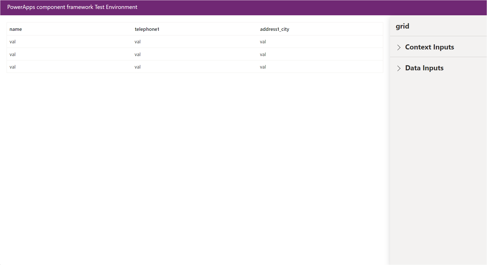
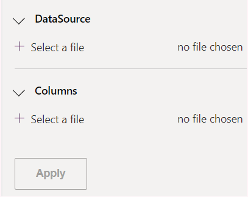
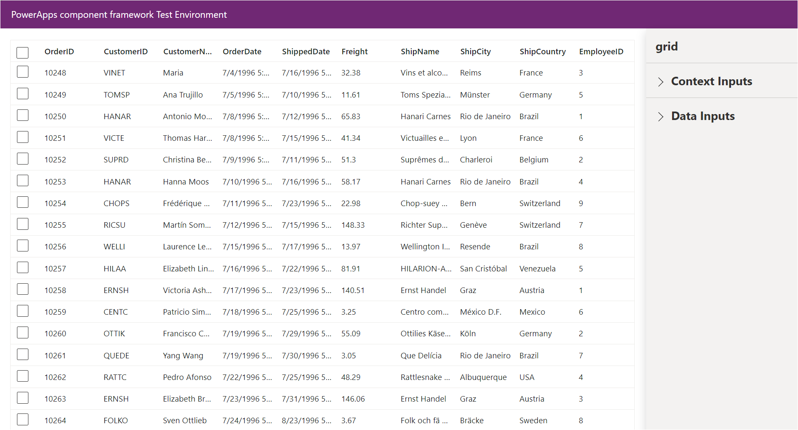

# Getting Started with Syncfusion Grid Code Component in Local (TestHarness)

This article provides a step-by-step guide to run the Syncfusion Grid code component in local (TestHarness).

## Prerequisites:

Before getting started with the Syncfusion Grid code component, ensure the following prerequisites are satisfied:

- [node.js  (>= v18.20.4)](https://nodejs.org/en/download/) (LTS version is recommended)
- [System requirements for Syncfusion React components](https://ej2.syncfusion.com/react/documentation/system-requirement)

## Rapid utilization of Grid code component

To run the Syncfusion Grid code component, follow these steps:

1. Ensure that all the prerequisites are met.

2. Open a command prompt (cmd) and navigate to the Grid code component, which is located in the [components/grids/](../../components/grids/) folder.

3. Utilize the following command to install the dependent packages:

```bash
npm install
```

4. Execute the sample with the following command to visualize the Grid code component:

```bash
npm start watch
```



5. Now, within the `Data Inputs` section of the property pane, designate the data source for the Grid code component using the [**GridData.csv**](../../components/grids/data/GridData.csv) & [**ColumnData.csv**](../../components/grids/data/ColumnData.csv) files.

> [!NOTE]
> After loading the data source and columns, proceed to select the required column types in the DataSource section and link the column properties with the corresponding CSV data in the property pane. For example, assign the `SingleLine.Text` column type for the `CustomerName` column of DataSource property. Then, establish the mapping between the `CustomerName` column and the `CustomerName` column of the CSV file of Column property.



6. After loading the CSV file, click the `Apply` button to load the data source in the Grid code component.



7. Customize the Grid code component properties in the right property pane.

> [!NOTE]
> Additionally, explore the [API documentation](./api.md) for comprehensive details on the properties, methods, and events of the Grid code component.

## See also

- [Getting Started with the Syncfusion PowerApps Grid Code Component in Canvas Application](getting-started-with-canvas.md)

- [Getting Started with the Syncfusion PowerApps Grid Code Component in Model-Driven Application (Form)](getting-started-with-model-driven-form.md)

- [Getting Started with the Syncfusion PowerApps Grid Code Component in Model-Driven Application (Custom Pages)](getting-started-with-model-driven-custom-pages.md)
