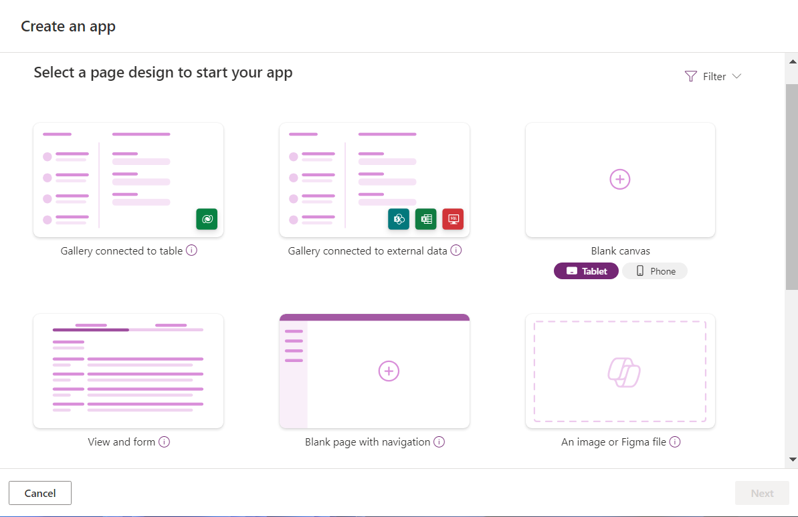
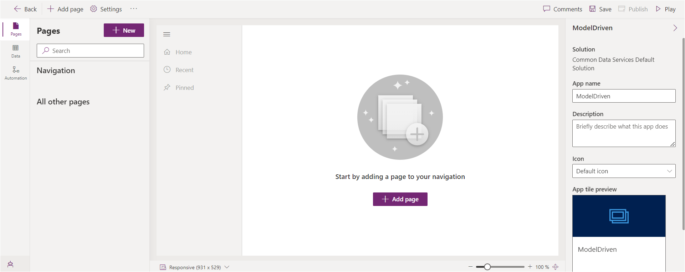
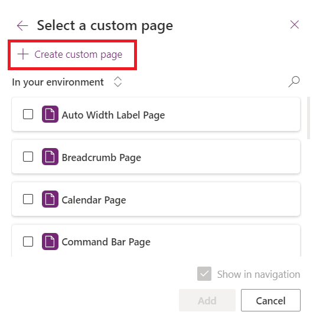
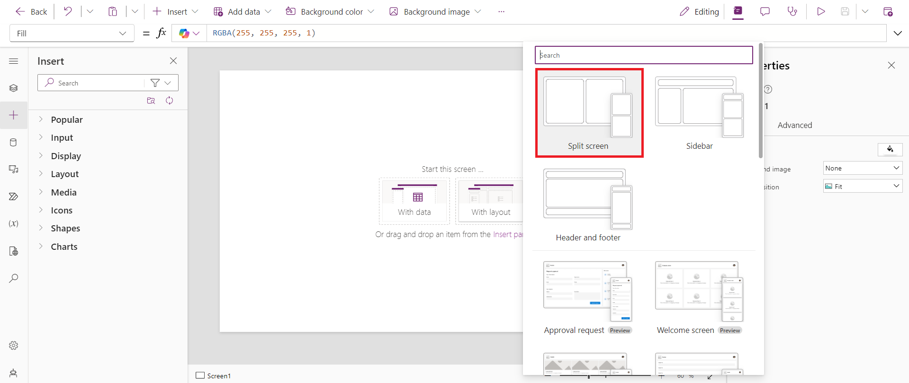
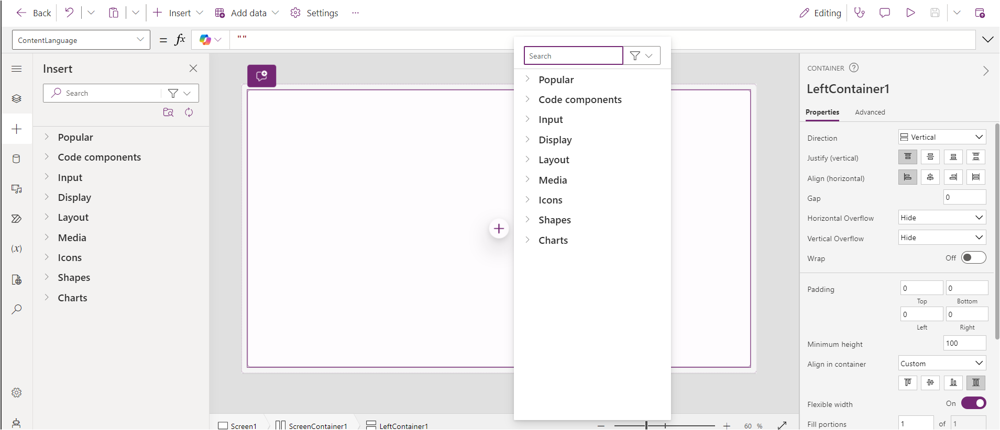
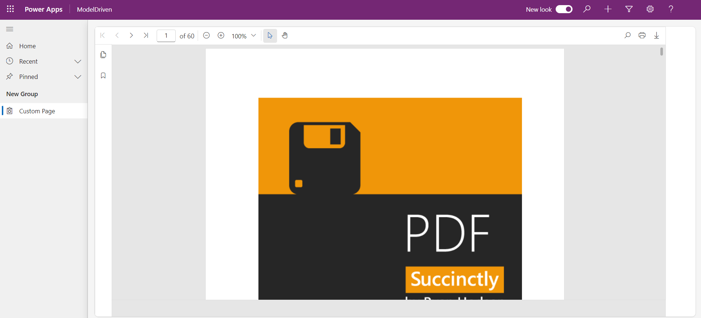

# Getting Started with Syncfusion PowerApps PdfViewer Code Component in Model-Driven Application (Custom Pages)

This article provides a step-by-step guide for setting up a PowerApps model-driven application with Custom pages (Canvas) and integrating the Syncfusion PowerApps PdfViewer code component.

PowerApps Model-Driven is a versatile platform for creating structured applications with a focus on data-centric design. It offers a guided approach, allowing users to build efficient business processes and workflows within a predefined data model.

## Prerequisites

- [Published Syncfusion PowerApps solution package](../../README.md#deploying-the-solution-package-in-the-powerapps-portal)

## Create a PowerApps Model-driven application

To create a model-driven application, follow the steps below:

1. In the [PowerApps portal](https://make.powerapps.com/), navigate to the `Apps` tab located in the left navigation pane and select the `Start with a page design` option.

2. Opt for the `Blank page with navigation` option and assign a meaningful name for your model-driven application. Proceed by clicking `create`.

3. The PowerApps platform will generate a blank model-driven application based on your specifications. You are now ready to start building your application.

4. To incorporate custom page into your application, click on the `Add Page` button. Select `Custom Page` & select `Create custom page` option. And assign a meaningful name for your custom page. Proceed by clicking `Add`.

5. The PowerApps platform will generate a blank custom page based on your specifications in a new tab. You are now ready to start building your custom page (Canvas).

6. Use any layouts & import the Syncfusion PowerApps PdfViewer code component to the custom page. Initially PdfViewer will use the default properties. You can customize the properties as per your requirements.

> [!NOTE]
> By default, the PdfViewer component is rendered with a 10% zoom level. You can adjust the zoom percentage through MagnificationTool in the toolbar settings.

> [!NOTE]
> Update the flexible height, width, and other properties of the PdfViewer code component to suit your application requirements. Also, refer to the [PdfViewer Canvas documentation](getting-started-with-canvas.md#add-syncfusion-powerapps-pdfviewer-code-component-into-canvas-application) for additional information.

7. Save the custom page and publish the changes to add it in the model-driven application.

8. After that in the previously created model-driven application, click on the `Publish` button to make the changes live.

> [!NOTE]
> For more information, refer to the [Create an blank Model-Driven app in PowerApps](https://learn.microsoft.com/en-us/power-apps/maker/model-driven-apps/build-app-three-steps).

## Publish the Syncfusion PowerApps PdfViewer application

After publishing the application, click the `play` button to preview the published application. You can also share the published application with your users.

## See Also

- [Getting Started with the Syncfusion PowerApps PdfViewer Code Component in Canvas Application](getting-started-with-canvas.md)

- [Getting Started with the Syncfusion PowerApps PdfViewer Code Component in Model-Driven Application (Form)](getting-started-with-model-driven-form.md)
